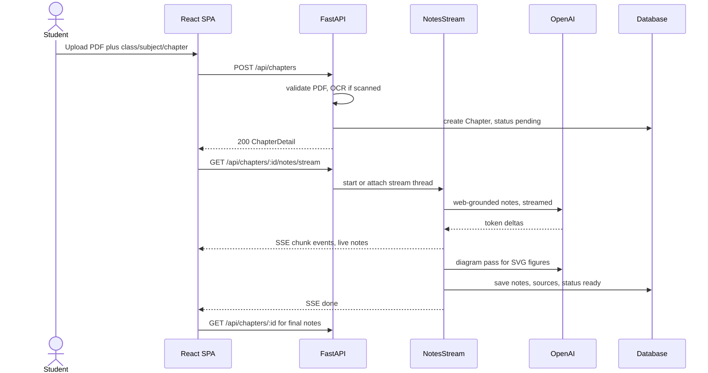
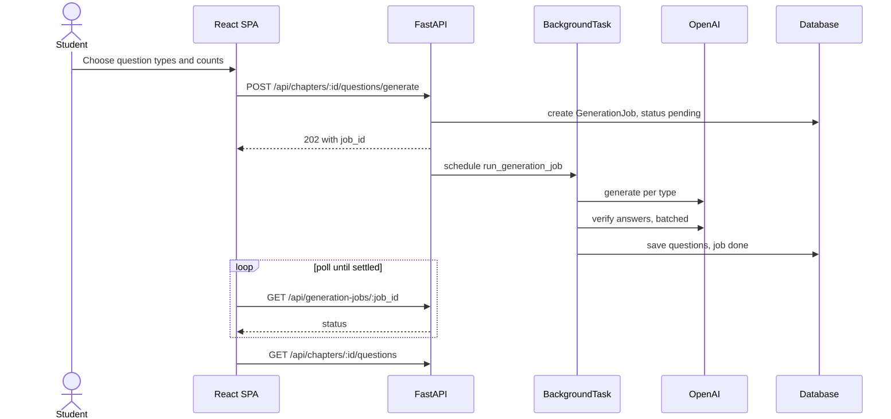
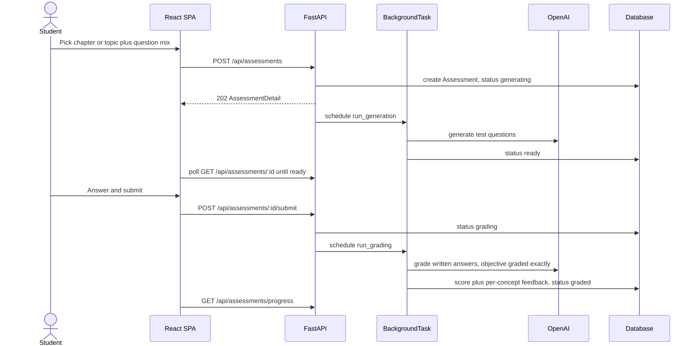

# StudyForge — Architecture

StudyForge turns a chapter PDF into topper-grade **notes**, a **verified question bank**,
and a self-**assessment** with per-concept feedback. It's a FastAPI backend + a
React/Vite/Chakra SPA, with a switchable SQLite/Postgres database and OpenAI for
generation (web-grounded).

> Diagrams are committed as SVG images (rendered from Mermaid). Sources live in
> [`docs/diagrams/`](diagrams/); regenerate with [`docs/diagrams/render.sh`](diagrams/render.sh).

## System overview

## Request layering

Every request flows through one direction — no layer reaches back up:

## Flow 1 — Upload a chapter, stream notes (SSE)

## Flow 2 — Generate a question bank (background job + poll)

## Flow 3 — Evaluate: generate a test, answer, grade

## Startup & migrations

## Deployment options

## Key cross-cutting pieces

| Concern | Where | Notes |
|---|---|---|
| Config / env flags | `core/config.py` | pydantic-settings; `DATABASE_URL`, `OPENAI_*`, `ENABLE_*`, `LOG_*`, `METRICS_ENABLED`, `MAX_UPLOAD_MB`, OCR, prices |
| LLM access | `agents/llm.py` | only place that calls the OpenAI SDK; retries, cost tracking, forced `web_search` |
| Prompts | `agents/prompts.py` | every prompt string lives here |
| Errors | `core/exceptions.py` | domain exceptions → one HTTP handler |
| Observability | `core/logging.py`, `core/metrics.py`, `api/routes/metrics.py` | JSON logs + correlation id; Prometheus metrics; DB gauges at scrape |
| Migrations | `db/migrate.py`, `alembic/` | auto-bootstrap; batch ALTER only on SQLite |
| DB switch | `db/session.py` | SQLite ↔ Postgres via `DATABASE_URL` |
